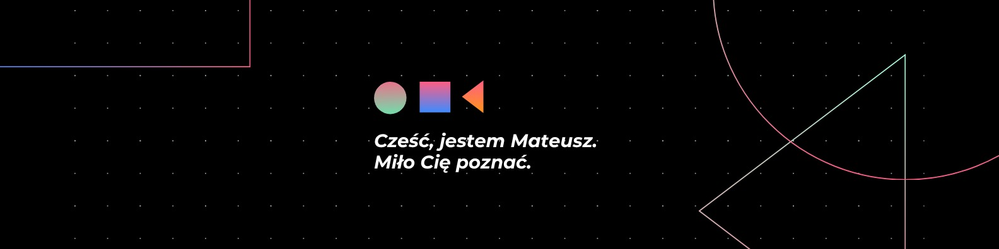

 

<!-- Social / Rzesoft -->

  

  

### 💻 Tech Stack

  
  
  
  
  
  
  
  
  
  

## 📊 GitHub Analytics

<table align="center">
<tr>
<td align="center">

</td>
<td align="center">

</td>
</tr>
</table>

---

 

### 📈 Activity

